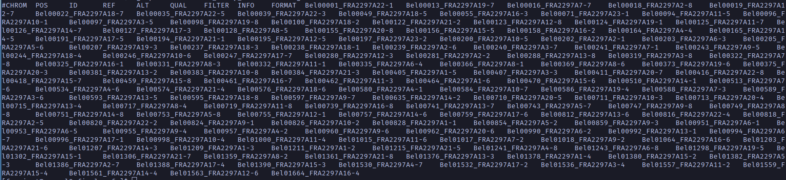
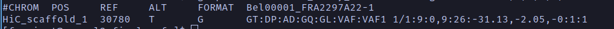
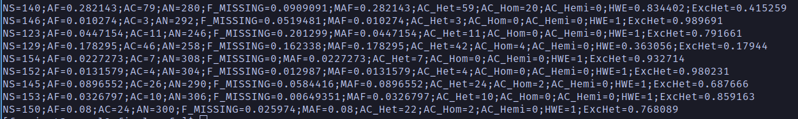

# Data Exploration

## VCF Files
The VCF file format (variant call format) is one of the many file types that you can use with genomic data. This file is generally quite a bit smaller than other file types because it *only contains data for the variable sites that have been called within a data set*. There is one row per site, and the data for each individual/sample is in a different column. A diagram giving a general picture for a VCF file is shown below (from Van der Auwera & O'Connor 2020).


A VCF file is a tab-delimited file that has three main parts:    
	1. A metadata header consisting of many lines that start with `##`;    
	2. A header line with the eight mandatory fields and the sample names for those samples that are genotyped; and    
	3. The data lines, where each line (row) consists of the information for a variant at a particular position and all the individual genotypes for this position.

A helpful video walking through this file format can be found [here](https://youtu.be/EpD2ZHM7Q8Q?si=0oTs1M3Lrc99d29O), and the official document specifying the VCF format can be found [here](https://samtools.github.io/hts-specs/VCFv4.2.pdf).

We can take a look at the beginning (the first 20 lines) of our VCF file with the following command. Here, we use the `-c` flag that tells `gunzip` not to unzip the file itself, but just to show it to the screen. We then pipe (`|`) that output into the `head` command, using the `-n` flag to specify that it show us the first 20 rows (by default, `head` will show the first 10 rows).
```
gunzip -c 0.01_fully_filtered.vcf.gz | head -n 20
```

If you run this command, you will see that all of the first 20 lines start with `##` and represent metadata. We can count the number of header lines with the following command.
```
gunzip -c  0.01_fully_filtered.vcf.gz | grep "^##" | wc -l
```

Here, we are using the Unix command `grep`, which is kind of like a "find" function, but is much more powerful. Here, we are using `grep` to find all of the rows that start with `##` (the 'carat' symbol, `^`, indicates the beginning of a line). We are then piping that output into the **word count** function (`wc`) and asking how many lines (the `-l` flag) match this pattern. The result should be **57**, indicating that there are 57 'header' lines in this file (and therefore that the row of data column names should be in row 58).

Note that from here on out we will actually use the `zgrep` command instead of `grep`, because it allows us to work with compressed files without having to uncompress them first (*i.e.,* using `gunzip`). In this way, the same thing as above could have been obtained with the following command, where the `-c` flag means to count.
```
zgrep -c "^##" 0.01_fully_filtered.vcf.gz
```

If we want to take a look at the non-header parts of this VCF file, we can use `zgrep` to show us the rows of data that **do not** start with `##` by simply adding the `-v` flag. So, to see the row of header names (the first row after the rows of metadata), we could use the following command.
```
zgrep -v "^##" 0.01_fully_filtered.vcf.gz | head -n 1
```

From this, you can see that the first nine columns are information about the data, and then the tenth column onward contain the data for each sample. A screenshot of this is shown below.



There is clearly a lot of information in this file, and we will not dive into all of it, but we will take a look at some. We can use the `cut` Unix command to show us some of the columns of the data file. Let's use that to look at some of the key columns, including for the first individual. The command and results are shown below.
```
zgrep -v "^##" 0.01_fully_filtered.vcf.gz | cut -f 1,2,4,5,9,10 | head -n 2
```


In the first column, labelled `#CHROM`, we can see that the reference genome has not been annotated to the chromosome level (otherwise this column would just have a 1, 2, 3, etc. indicating on which chromosome each variable site is located). Instead, the sites have been mapped to **scaffolds**. In this case, the first site in our VCF file is located at position `30780` on scaffold 1 (`HiC_scaffold_1`) of the reference genome.

We can also see that the reference allele (`REF`) for this site is `T`, and the alternative allele (`ALT`) for this site is `G`. The next column describes the format of the data for each individual. In this case it is `GT:DP:AD:GQ:GC:VAF:VAF1`. We'll walk through what these mean below.

| Data Type | Description | Value for First Sample |
|-----------|-------------|------------------------|
| GT | Genotype of the individual at this site | 1/1 or G/G (0 would be the reference) |
| DP | Read depth at this site for this sample | 9 |
| AD | Allelic depth. The number of reads supporting each allele | 0,9 |
| GQ | Genotype quality as a [phred score](https://en.wikipedia.org/wiki/Phred_quality_score) | 26 |
| GL | Genotype likelihood (log scale, for genotypes 0/0, 0/1, and 1/1, respectively) | -31.13, -2.05, -0 |
| VAF | Variant Allele Fraction (proportion of reads that support genotype) | 1 | 
| VAF1 | Not sure how this differs from above| 1 |

Another important column, which was not shown above, is the `FILTER` column (column 7 of the VCF file), which states whether or not each site passed all of the quality check filters (`PASS`). If not, this column will contain a semi-colon-delimited list of codes for the filters that failed. We can see this with the command below. Not surprisingly, since we are already dealing with a filtered data set, all sites have passed all filters.
```
zgrep -v "^##" 0.01_fully_filtered.vcf.gz | cut -f 1-7 | head -n 50
```

Lastly, the eighth column (title `INFO`) contains a lot of information that is very helpful. We can view this with the command below, with the results shown after that.
```
zgrep -v "^##" 0.01_fully_filtered.vcf.gz | cut -f 8 | head -n 10
```



There is a lot of information here! It is all relevant to the **site** (*i.e.,* the characteristics of the site across all samples). The meaning of these values is described below.

| Code | Description | Value for first site |
|------|-------------|----------------------|
| NS   | Number of samples with data | 140 |
| AF   | Frequency of the alternate allele (AC/AN)| 0.282143 |
| AC   | Allele counts of alternate allele | 79 |
| AN   | Total number of alleles called | 280 |
| F_MISSING | Fraction of individuals missing a genotype at this site | 0.0909091 |
| MAF | Minor allele frequency | 0.282143 |
| AC_Het | Allele counts heterozygous | 59 |
| AC_Hom | Allele counts homozygous | 20 |
| AC_Hemi | Allele counts hemizygous | 0 |
| HWE | The p-value associated with calculation of Hardy-Weinberg Equilibrium | 0.834402 |
| ExcHet | How much more heterozygous a site is than expected under HWE | 0.415259 |

That's it. Hopefully now you have a relatively good feel of the data in the VCF file, how it is organized, and how you can view different aspects of it.


## References
Van der Auwera GA, O'Connor BD (2020) *Genomics in the Cloud: Using Docker, GATK, and WDL in Terra*. O'Reilly, Sebastopol, CA.


