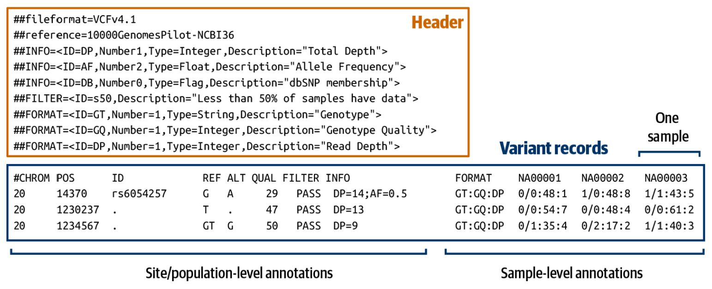

# Data Exploration

## VCF Files
The VCF file format (variant call format) is one of the many file types that you can use with genomic data. This file is generally quite a bit smaller than other file types because it *only contains data for the variable sites that have been called within a data set*. There is one row per site, and the data for each individual/sample is in a different column. A diagram giving a general picture for a VCF file is shown below (from Van der Auwera & O'Connor 2020).



A VCF file is a tab-delimited file that has three main parts:    
	1. A metadata header consisting of many lines that start with `##`;    
	2. A header line with the eight mandatory fields and the sample names for those samples that are genotyped; and    
	3. The data lines, where each line (row) consists of the information for a variant at a particular position and all the individual genotypes for this position.

A helpful video walking through this file format can be found [here](https://youtu.be/EpD2ZHM7Q8Q?si=0oTs1M3Lrc99d29O), and the official document specifying the VCF format can be found [here](https://samtools.github.io/hts-specs/VCFv4.2.pdf).

We can take a look at the beginning (the first 20 lines) of our VCF file with the following command. Here, we use the `-c` flag that tells `gunzip` not to unzip the file itself, but just to show it to the screen. We then pipe (`|`) that output into the `head` command, using the `-n` flag to specify that it show us the first 20 rows (by default, `head` will show the first 10 rows).
```
gunzip -c 0.01_fully_filtered.vcf.gz | head -n 20
```

If you run this command, you will see that all of the first 50 lines start with `##` and represent metadata. We can count the number of header lines with the following command.
```
gunzip -c  0.01_fully_filtered.vcf.gz | grep "^##" | wc -l
```

Here, we are using the Unix command `grep`, which is kind of like a "find" function, but is much more powerful. Here, we are using `grep` to find all of the rows that start with `##` (the 'carat' symbol, `^`, indicates the beginning of a line). We are then piping that output into the **word count** function (`wc`) and asking how many lines (the `-l` flag) match this pattern. The result should be **57**, indicating that there are 57 'header' lines in this file (and therefore that the row of data column names should be in row 58).


## References
Van der Auwera GA, O'Connor BD (2020) *Genomics in the Cloud: Using Docker, GATK, and WDL in Terra*. O'Reilly, Sebastopol, CA.


